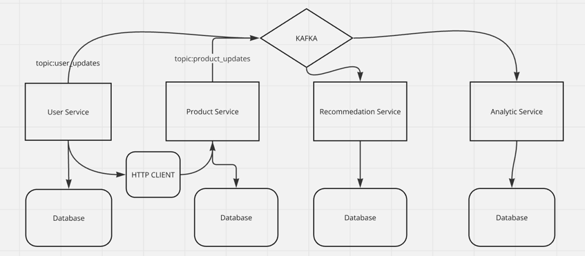

### Контакты для связи: 
**telegram**
- @sonialeena 

**gmail**
- ramazanovshamil202@gmail.com
- 
**Ссылка на видео работы микросервисов:** 
- https://www.vidline.com/share/V0R6H24412/1172c32ba27816dd33a09702ea934f47
- Запасная ссылка на видео: https://drive.google.com/file/d/1n0v9BfZN7vXFqcjYj0OInqTIvfxjUgiy/view?usp=sharing

### Инструкция запуска микросервисов и описание архитектуры и настроек:
### Инструкция к запуску:
    1)Создаем сеть docker: docker network create my_shared_network
    2)В корневой директории поднимаем кафку: docker-compose -f docker-compose-kafka.yml up
    3)Переходим в сервис User_Service:           docker build -t userservice .
                                                 docker-compose up
    4)Переходим в сервис Product_Service:        docker build -t productservice .
                                                 docker-compose up
    5)Переходим в сервис Recommendation_Service: docker build -t recservice .
                                                 docker-compose up
    6)Переходим в сервис Analytics_Service:      docker build -t analservice .
                                                 docker-compose up
### Архитектура и настройки:

**Сервис пользователей:**
- Swagger-документация доступна по адресу localhost:8082/swagger/index.html
- Регистрирует пользователей, сохраняет в БД PostgreSQl http://localhost:8082/auth/sign-up
- Авторизирует пользователей, после создает JWT токен для дальнейшей аутенфикации http://localhost:8082/auth/sign-in
- Для обновления данных пользователя http://localhost:8082/users/{id}, id из JWT токена
- После регистрации и добавления в БД отправляется сообщение в кафку в топик user_updates по ключу user_id

**Сервис продуктов:**
- Сервис работает только с сервисом юзера потому что надо знать id userа
- Сервис работает только с сервисом еще по причине что у нас проверяется x-auth-key в сервисе продуктов
- Swagger-документация доступна по адресу localhost:8083/swagger/index.html
- Для взаимодействия с сервисом продуктов используется клиент на стороне сервиса пользователя
- Клиент на стороне пользователя отправляет запрос по протоколу http в сервис пользователей
- На стороне сервиса продуктов проверяется ключ, для того чтобы знать с какого сервиса пришел запрос
- В сервисе продуктов доступны: получения всех продуктов, добавления, обновление продукта в корзину
- Отправляется в кафку сообщения о корзине в топик product_updates

**Сервис рекомендаций:**
- Swagger-документация доступна по адресу localhost:8084/swagger/index.html
- Подписывается на сообщения из тем user_updates и product_updates.
- Используется кеширование Cache-Aside 
- Проверяет есть ли данные в кэше по ключу user_id, если нет то обращается к БД
- На основе полученных данных генерирует рекомендации по категории товара
- Он никак не знает БД у сервиса продуктов, а читается сообщения из кафки
- Сохраняет рекомендации в базе данных.

**Сервис аналитики:**
- Swagger-документация доступна по адресу localhost:8085/swagger/index.html
- Подписывается на события топики user_updates и product_updates
- Собирает статистику по популярности продуктов и информацию пользователей
- Хранит данные в базе данных для дальнейшего анализа.
- Также есть API для получения всей статистики
- Использует БД PostgreSQL, но лучше использовать БД на основе столбцов, например ClickHouse

**Кэширование:**
- Используется кеширование Redis для кэширования часто запрашиваемых рекомендаций по ключу user_id
- Сначала добавляются в базу данных, только потом в redis,
- Когда запрашиваются данные сначала смотрятся в redis затем в бд

    
    
